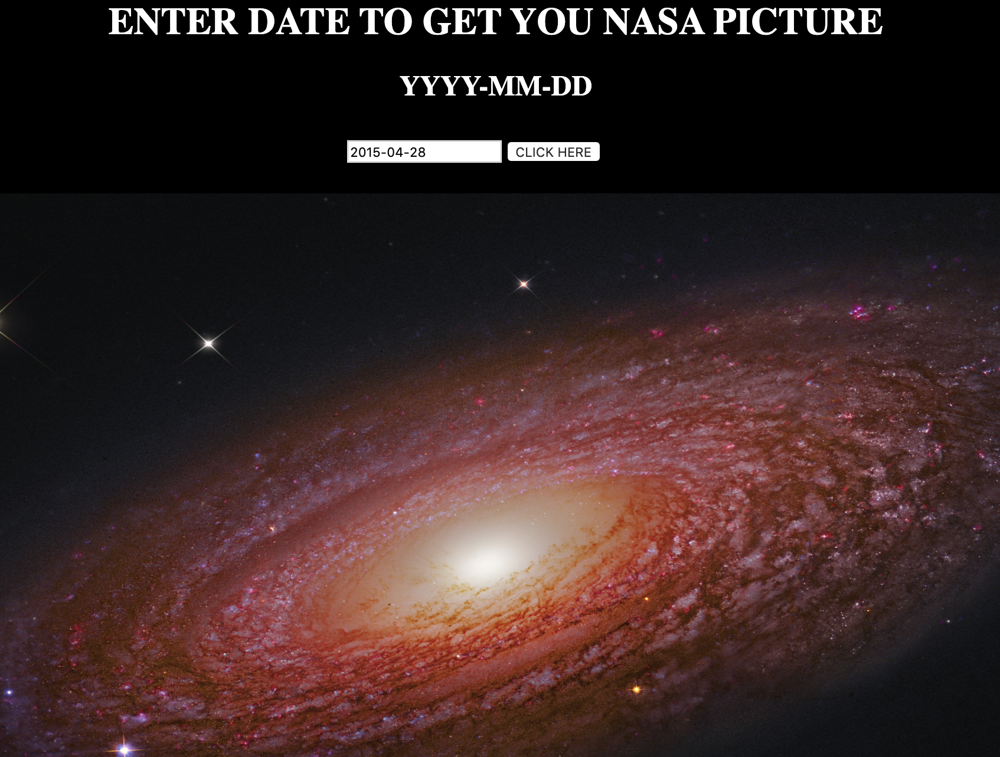

# 🚀 Project: Simple NASA API

### Goal: Enable your user to enter a date and return the picture/video of the day from NASA's API

### Click to Use: https://ecstatic-keller-e79c69.netlify.com/

- In this project I used a NASA API in order to receive daily pictures from the different NASA stations.

Tech used:
- HTML5
- CSS
- Javascript
- NASA API from https://api.nasa.gov/
