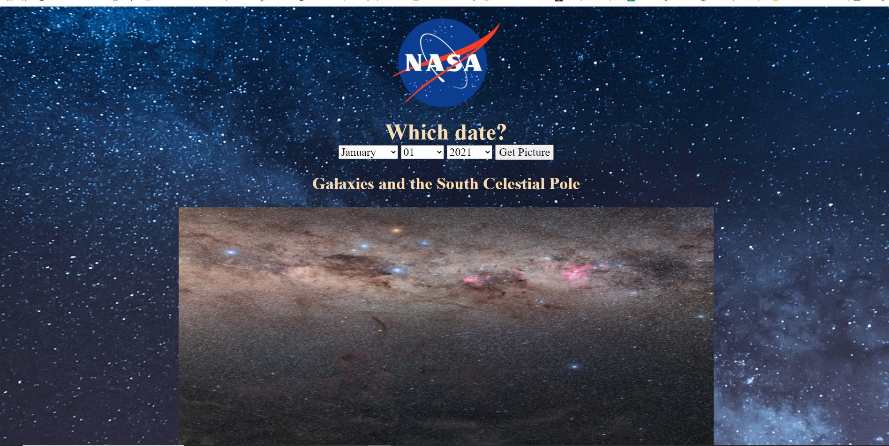

# Simple NASA API
A front end app that leverages the nasa api to retrive the nasa picture of the day

### Tech used:
HTML, CSS & JavaScript

## How it is made
Used the Nasa Api, along side promises to make fetch request and retrive the picture of the day 
