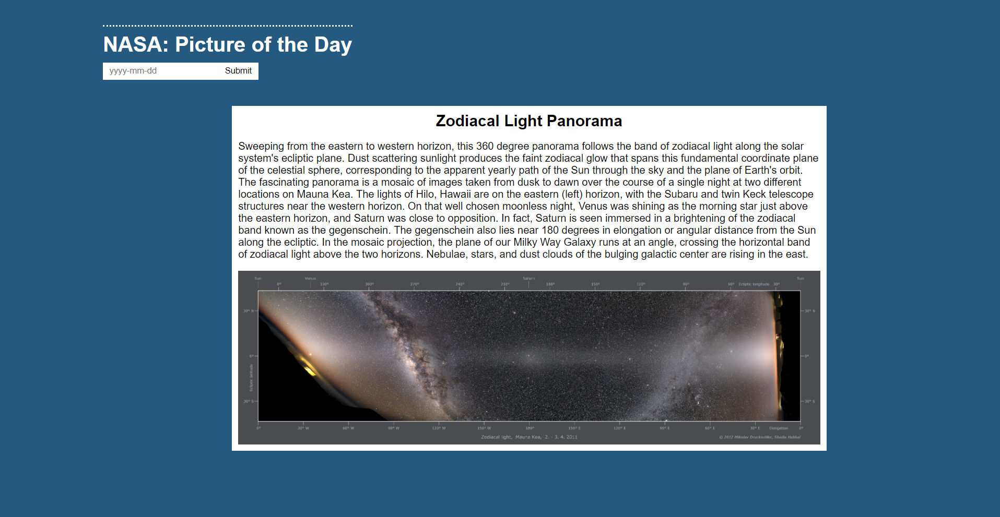

# 🚀 Week07 Bootcamp2019a Project: Simple NASA API

On this site, user must enter a date to get NASA's picture of the day.

## How It's Made:

**Tech Used:** HTML, JS, NASA apod api

Created a simple layout setup in HTML with my header containing the h1 and the form containing the input and submit button, then a section that will contain the picture of the day, the title and a little description for the picture. Within the Javascript the date entered in by the user is submitted into the api as a parameter. The api returns a json containing all the data it has on the picture for the date searched, and I personally picked the title, description and picture to be displayed into the DOM for the user to see. I used flexbox CSS to style the page.

## Lessons Learned:

I learned that iframes have some weird default styling within the browser. Starting to understand flexbox a bit more and also found a really nice way to remove the input value without using jquery.
