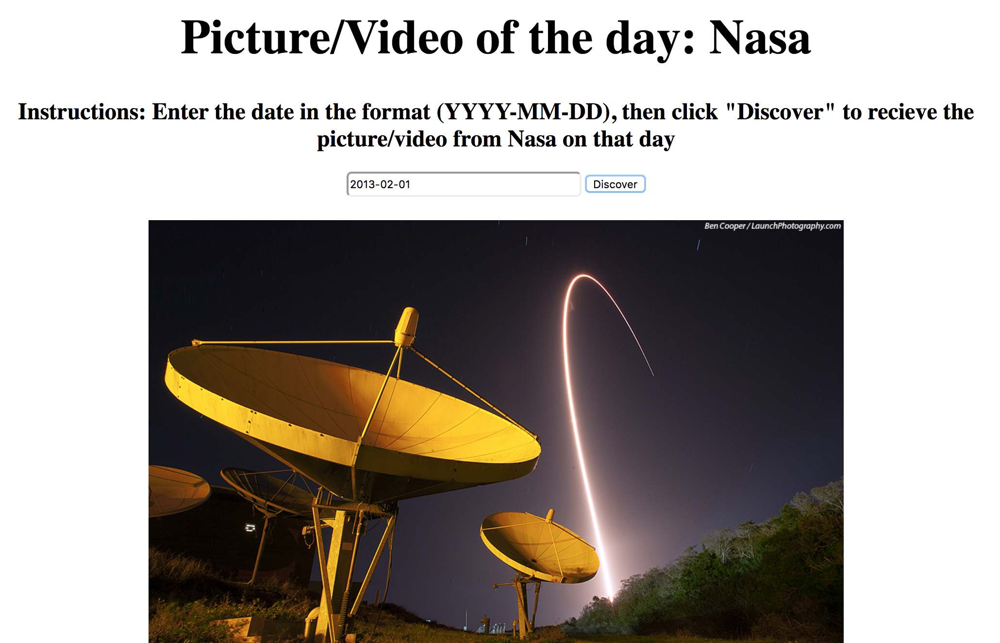

# 🚀 Project: Simple NASA API

### Goal: Enable your user to enter a date and return the picture/video of the day from NASA's API

* **Project Title: What's going on outer-space?**
  - "What's going on outer-space?" is a webpage that lets you view a picture or video that nasa collected on that given day.

* **Overview**
  - It pulls data from the "Nasa's" API. It receives the picture or video that they took on that given day.
  - This page was created for anyone that loves nasa and has a curiosity for what they looked at on that day. The images and videos are supercool and remind me of computer wallpapers. The photos can be saved and used on future projects, print outs you name it.

* **link to project**: https://sleepy-kowalevski-0d4bb8.netlify.com

* **Image of project in use**

* **Getting Started**
  - Click on the link above
  - Enter the date you wish to view, ex:(2001,02,12)
  - click on the "Discover" button to receive a video or image from their satellite on that given day!
