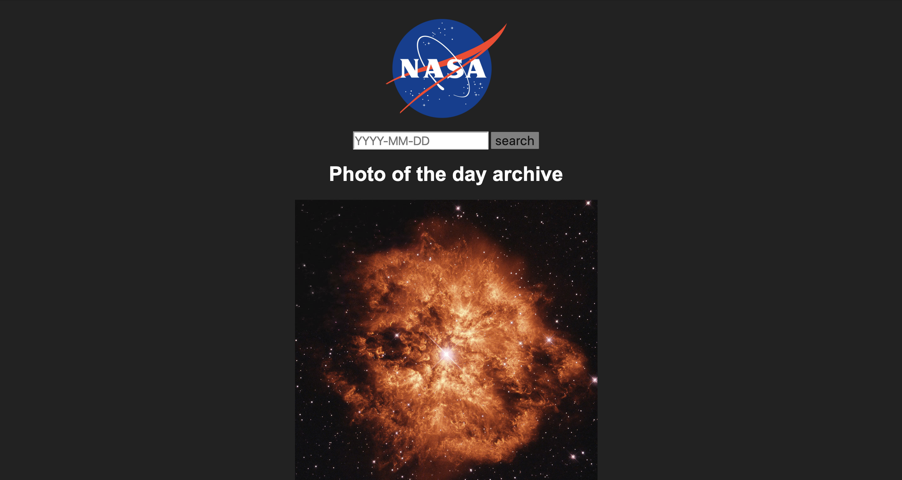

# Simple NASA API
#### Project Scope: Enter a date (YYYY-MM-DD) to receive an image or video from NASA's photo of the day API!
#### View here: https://svdev-nasa.netlify.com

# How it was made:
#### HTML5, CSS3, Javascript E6, API, JSON

# Optimizations:
#### This simple API displays both images and videos from NASA's API.

# Lesson Learned: 
#### To manipulate the data in the NASA API using the fetch method and view object arrays appear in the console. 
