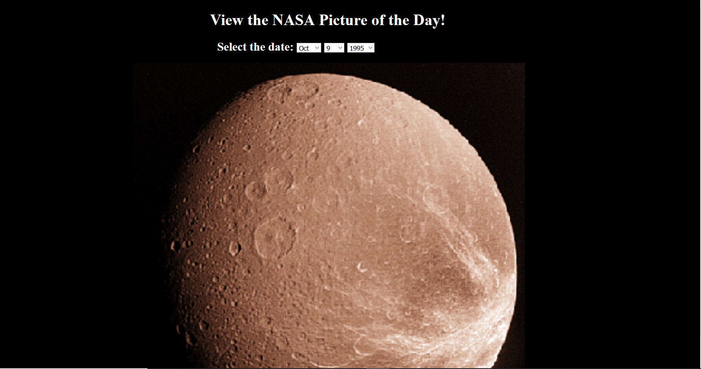

# 🚀 Project: Simple NASA API
link: https://cranky-euler-a8981f.netlify.com

### Goal: Enable the user to enter a date and return the picture/video of the day from NASA's API

### How I did this

- Technologies: HTML, CSS, JS
- Created 3 input fields that let you select dates
- Added event listeners to the input fields to detect change in their values
- Wrote conditionals so that the functions of the listeners would only update if all 3 had been activated
- Recorded the values of the inputs and used them to make an API call to NASA's database
- Recieved the json object and extracted the url for the image of the particular day, used that as the src attribute of a hidden image tag in the html
