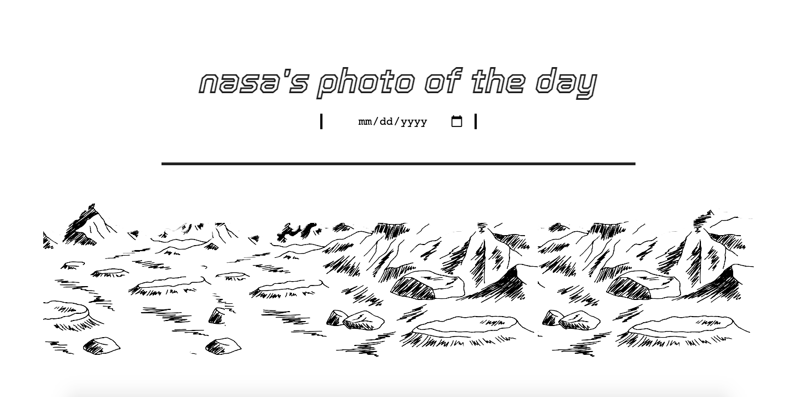

## 🚀 Goal
Enable your user to enter a date and return the picture/video of the day from NASA's API

## 🚀 How it's made
Made using HTML, CSS, Javascript, API and JSON. This is also a mobile, tablet, and desktop responsive.

## 🚀 Lesson Learned
We use APIs for everything, so this was a relatively easy, fascinating, and super important thing to learn for me. 
