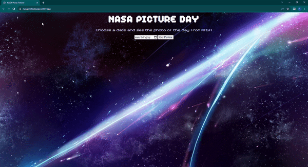

# NASA Photo Fetcher
Write a short sentence or two about this project and what it does. Be sure to include a link and a screenshot (we're front end devs so we can actually see our work!).

Link to project: https://nasaphotodayapi.netlify.app/

## How It's Made:

Tech used: HTML, CSS, JavaScript

I used HTML to create the frame of the website. I used CSS to style the sections where the information of the API data will show on the DOM. Then I used JavaScript to create an event listener on the button so that when the user submits a date input, it runs the function seeSpace. This function uses fetch with the NASA Photo API. From the NASA Photo API data, I pulled information from the database based on photo of the date. Then I pulled was the image of the day, the description of the image, and the name of the image. I displayed that information on the DOM in the sections I created for them in HTML. 

## Optimizations

I noticed that some dates returned videos instead of images. To account for this, I created a condtion that check for the media type of the data returned and if it was a image to display the image to the DOM. If it was a video to display the video to the DOM. I noticed another issue that if the user requested more than one date back to back, the previous image or video requested would stay on the DOM. I created a hidden class and added it to the image element and iframe element. Then when the condition check the media type it would hide any image elements if the media type was a video. If the data had a media type of a video then it would hide any images elements. 

## Lessons Learned:

With this project, I learned how to utilize the remove and add methods for classes.