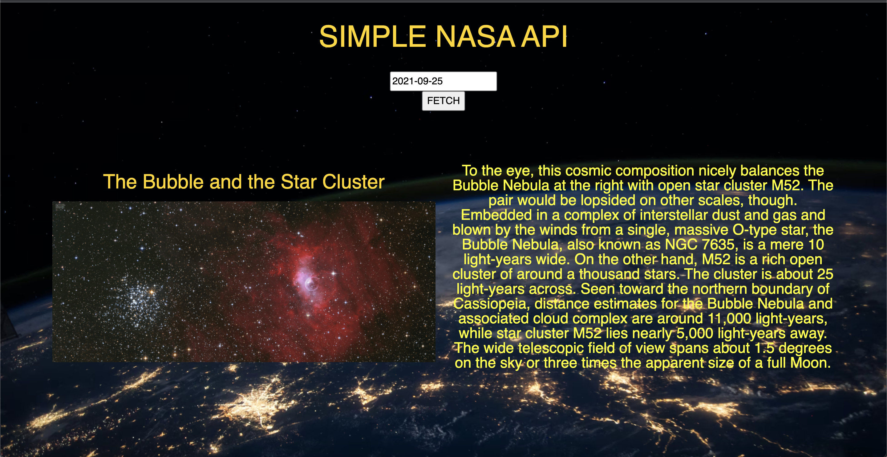

# 🎰 Week08 Bootcamp2021 Project: Simple NASA API Project

### Goal: Build a Simple Nasa API

This is my simple NASA API project! Users can enter in a numerical date value by year, month, and day  (Ex: 1997-04-02) and the application will fetch the image or video of the day and its description for that specific date.

</img>

Link to live site: [https://danielmtran-simplenasaapi.netlify.app]

### How It's Made:

Tech used: HTML, CSS, JAVASCRIPT

I made the basic styling and layout of the app via HTML and CSS. The main functionality of the app was made using Javascript.

### Optimizations:

### Lessons Learned:

This project was my first real introduction to API's. 