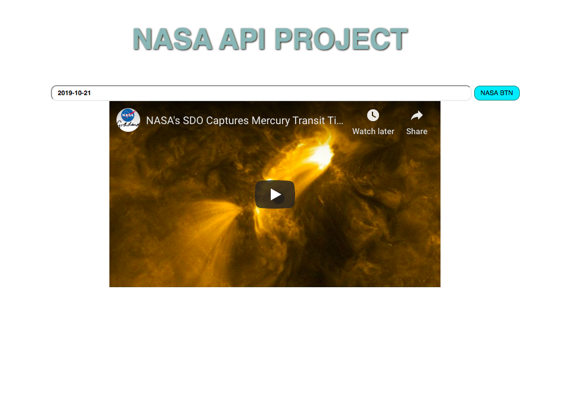

# 🚀 Project: Simple NASA API

Enables the user to enter a date and return the picture/video of the day from NASA's API

### Goal: Display data returned from an api

TOOLS used: HTML, CSS, JAVASCRIPT

