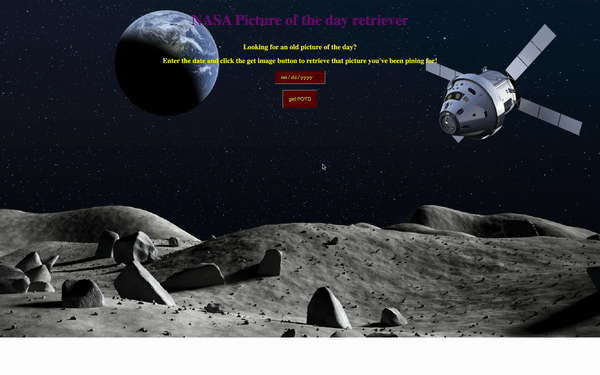

# Nasa Picture of the Day

This app allows the user to see the current and past piture of the day ('POTD') from Nasa's very own api. 

**Link to project:** https://cydvilla.github.io/simple-nasa-api-bootcamp/

## How It's Made:

**Tech used:** HTML, CSS, JavaScript

Utilziing JavaScript, this project requires the user to input a date, which is then queried by the API to return an image (or video) of the day associated with that date.
<!-- ## Optimizations
*(optional)*

You don't have to include this section but interviewers *love* that you can not only deliver a final product that looks great but also functions efficiently. Did you write something then refactor it later and the result was 5x faster than the original implementation? Did you cache your assets? Things that you write in this section are **GREAT** to bring up in interviews and you can use this section as reference when studying for technical interviews! -->

## Lessons Learned:

I almost missed that videos were included in the POTD, I would have had undefined data otherwise had I not added code to account for it. 
