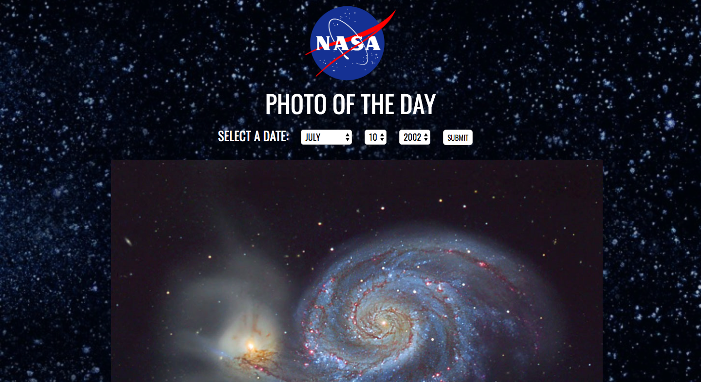

# 🚀 Project: Simple NASA API

### Goal: Enable your user to enter a date and return the picture/video of the day from NASA's API

**View project in browser:** https://endev-nasa-simple-api.netlify.com/

## Design and Development:
**Tech Used** HTML, CSS, JavaScript: 
This site was built using HTML, CSS, and media queries for responsiveness. I had a screenshot of the website and replicated the elements to the best of my abilities, making it almost picture perfect!

## Lessons Learned:
This is the first responsive site I designed and developed with the "Mobile First" principle in mind. It was important to think about what functions the user would want / need on a mobile device vs. in a full browser. Planning ahead made it easier to set up and classify elements that needed to be hidden in one query but not others. It also provided a deeper understanding about what responsive web design means: to adapt and be functional across user devices, not just placing everything in one big column. 

## API Source:
**NASA:** https://api.nasa.gov/#live_example
